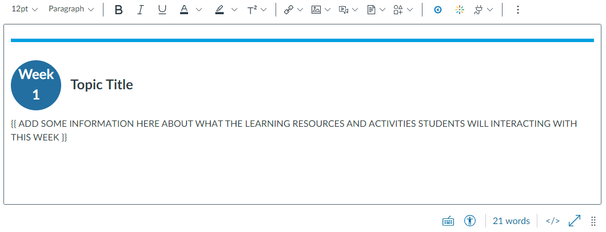
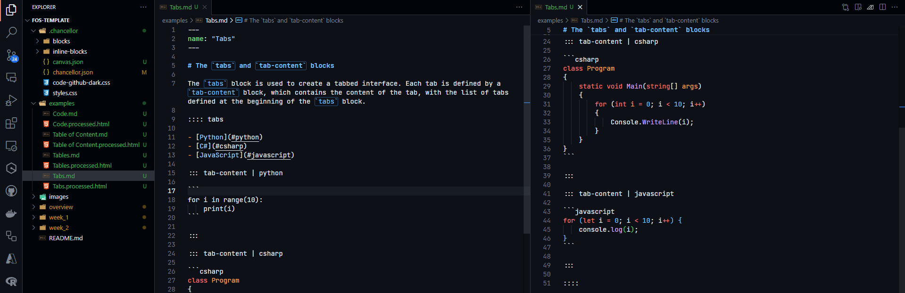
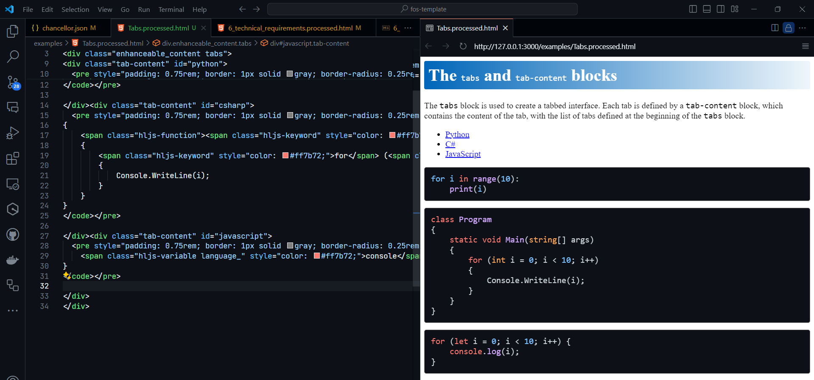
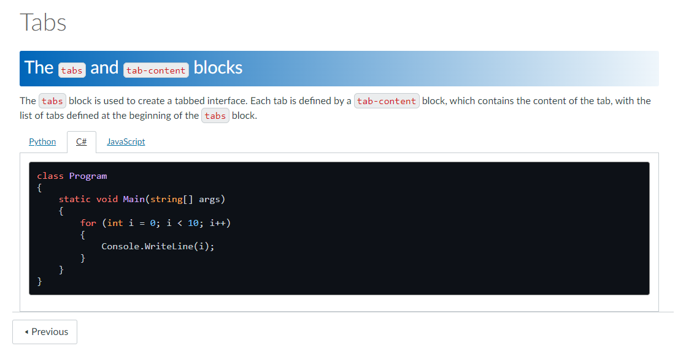

<!-- 
_backgroundImage: url('backgrounds/Title.PNG')
_class: title
 -->

# Chancellor CLI - Markdown-Based L&T Materials

**By: Dan Tran**, under the supervision of:

- **Dr Jake Bradford** - Project Lead
- **Associate Professor Gentry White** - Project Member

Faculty of Science

---
<!-- 
footer: '**Chancellor CLI - Markdown-Based L&T Materials**<br>Faculty of Science'
-->

# Canvas LMS

The **Canvas Learning Management System (LMS)** allows the creation of online learning materials through a rich text editor with a WYSIWYG interface.



---

# The Problem

While convenient for simple tasks like fixing typos, or uploading a single file, it has limitations for more **complex tasks** like:

- Creating a whole unit with **hundreds of pages** and **files**
- Curating a **consistent look and feel** across all materials
- **Updating** all materials for a new semester
  - E.g., update all occurrences of "2023" to "2024"
- And more...

Resulting in **tedious, error-prone, and time-consuming** work.

---

# An inspiration - Markdown

**Markdown** is a lightweight markup language with plain text formatting syntax.

<div style="display: flex; gap: 1rem">

<div style="flex: 0.5">

````markdown
**Bold text** and *italic text*
- List item 1
- List item 2
```csharp
class Program {
    static void Main() {
        Console.WriteLine("Hello, World!");
    }
}
```
````

</div>

<small style="flex: 0.35; overflow-y: scroll">

**Bold text** and *italic text*
- List item 1
- List item 2
```csharp
class Program {
    static void Main() {
        Console.WriteLine("Hello, World!");
    }
}
```

</small>

</div>

It is **easy to read** and **write**, and can be **converted** to HTML, PDF, and more.
- Even this presentation is written in Markdown!

---

# The Solution - Chancellor


Write **Markdown** files with your favourite text editor (e.g., VS Code).



---

# The Solution - Chancellor

`chancellor run render` converts Markdown files to HTML.



---

# The Solution - Chancellor

`chancellor run canvas-deploy` to upload to Canvas.



---

# Alpha Release of the `chancellor-cli` tool

Deployed to `npm chancellor-cli` for easy installation.

- **Render** Markdown to HTML
  - Custom blocks
  - Styling with CSS
- **Deploy** to Canvas
  - Update existing pages or create new ones
  - Organise pages into modules
  - Automatically update files and links to other pages

Find out more at https://github.com/Chancellor-LMS/chancellor-cli.git

---

# Demo & Showcase

- **Demo**: Deploying from the FoS template

- **Showcase**: Experimented on a few units to various degrees:
  - **CAB302** - Software Development
  - **EGD103** - Computing and Data for Engineers (QUT College)
  - **CAB201** - Programming Principles
  - **CAB301** - Algorithm and Complexity

---

# Future Work

We are looking for **feedback** on the tool and **feature requests** via GitHub issues: https://github.com/Chancellor-LMS/chancellor-cli/issues

A template is available at:

https://github.com/Chancellor-LMS/fos-template

Otherwise:

- **Graphical User Interface (GUI)** built on top of the CLI
- Using **Git** for version control
- **Documentation** and **user guides**
- (If time permits) Render to PDF, generate static site (GitHub Pages)