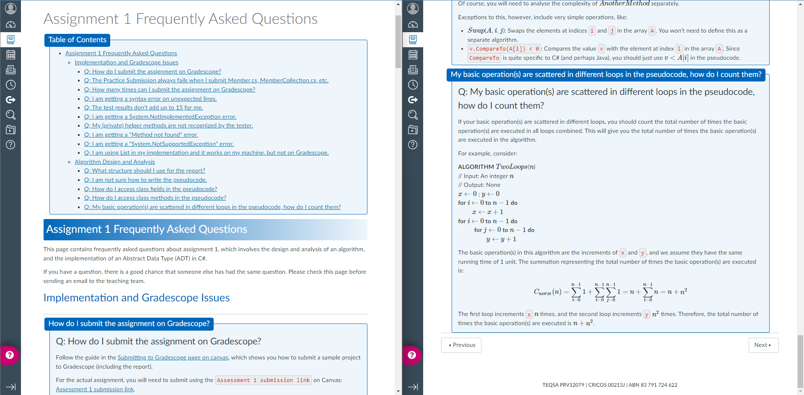
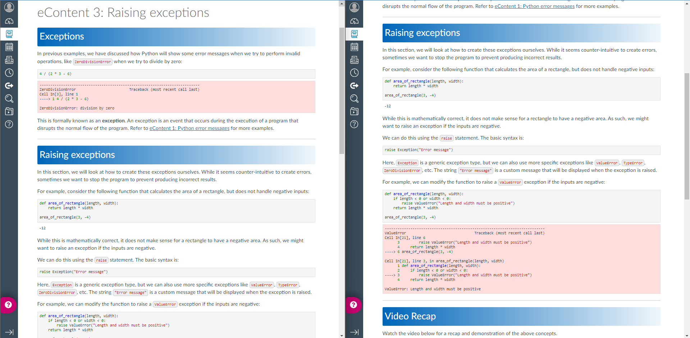

# Chancellor Usage by Units

| Unit | Name | Modules | Pages |
| --- | --- | --- | --- |
| CAB301 | Algorithms and Complexity | 3 | 5 |
| CAB302 | Software Development | 8 | 10 |
| EGD103 | Computing and Data for Engineers | 4 | 16 |
| CAB201 | Programming Principles | 3 | 6 |

General Notes:

- The modules above are **not** created by Chancellor
  - I used `chancellor canvas-link ./path/to/page.md page-url` to link an `.md` page to an existing Canvas page
  - This is because the modules were already created in Canvas

Unit-specific notes and screenshots of **highlights** are below. I'm not sure if it is appropriate to share the markdown files that were used to generate these pages, but the examples in the `fos-template` should give a decent idea (although it's not fully complete).

## CAB301 - Algorithms and Complexity

Most of the pages are not consumed by students, but are materials for teaching staff.

Examples:

(Staff Material) Guide to **Marking Gradescope Assignments** (tabs and coloured notes):

(Student Material) **Assignment 1 FAQs** (with maths equations):

(Student Material) **Workshop Question Deep Dive** (code snippets):

## CAB302 - Software Development

I listed 10 pages created by Chancellor, but another 13 pages were created by a tool I made that inspired Chancellor.

So far this unit has the most Chancellor-created content (as the pages are pretty long).

Examples:

**Persistence in Java** (code snippets from different languages - SQL and Java, tables, vertical tabs and side-by-side content):

**Persistence in Java (cont.)** (horizontal and vertical tabs on the same page):

**Continuous Integration** (snippet with file name, gifs, different languages - YAML, Java, XML and command line):

**Practical on Databases** (gifs, accordion):

## EGD103 - Computing and Data for Engineers

This unit has a different approach from CAB302 where each page is rather small, but each module contains a good number of pages.

The major highlight is how Chancellor can accommodate different syntax highlighting to match the unit's experience.

Examples:

**Sets in Python** (side-by-side, tabs, and Jupyter-like code):

**Raising exceptions** (more code snippets highlighting - with error cells):

**Nested loops** (differently styled accordion from 302):

## CAB201 - Programming Principles

CAB201 does not use the **pushing to Canvas**, and the HTML are copied and pasted manually to Canvas, but the idea is still the same.

Example:

**Solutions to Polymorphism practical** (intense use of tabs):

